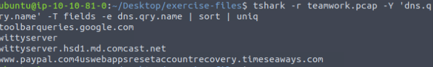
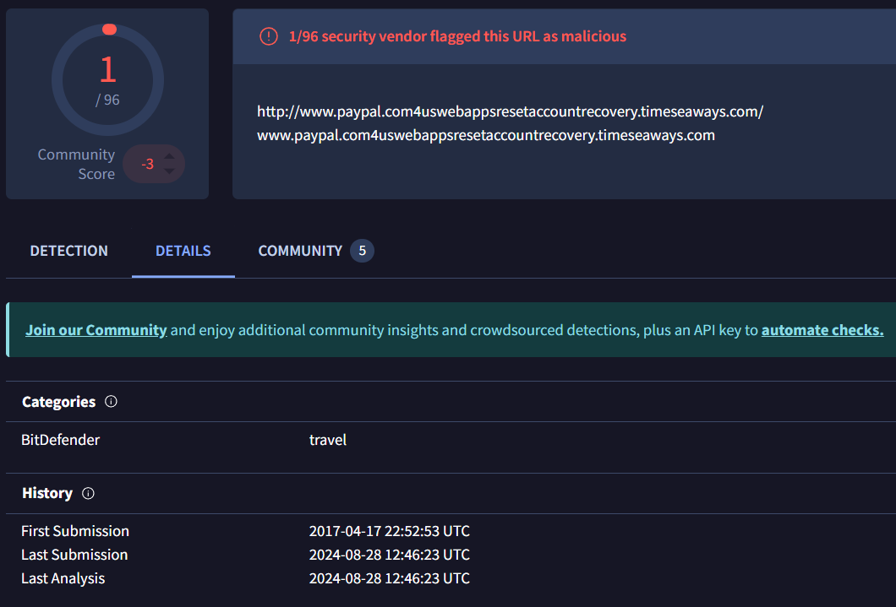
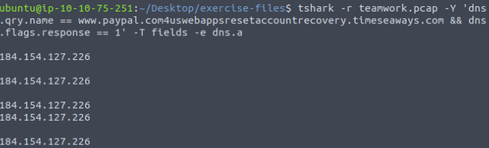
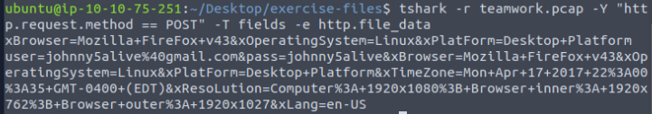

# FORENSICS CHALLENGE

## THM_TShark-Challenge-I
*https://tryhackme.com/r/room/tsharkchallengesone*

**Description**
This room presents you with a challenge to investigate some traffic data as a part of the SOC team. Let's start working with TShark to analyse the captured traffic.

An alert has been triggered: "The threat research team discovered a suspicious domain that could be a potential threat to the organisation."

The case was assigned to you. Inspect the provided teamwork.pcap located in ~/Desktop/exercise-files and create artefacts for detection tooling.

Your tools: TShark, VirusTotal.

**Walkthrough**

Navigate to the directectory 
- cd ~/Desktop/exercise-files
- ls

Using Tshark i want to read the teamwork.pcap file and extract all DNS query names. Then displays them in a simple list format. It filters the packets to include only those with DNS query names and outputs only the query names without any other packet details.
- tshark -r teamwork.pcap -Y 'dns.qry.name' -T fields -e dns.qry.name
- | sort | uniq (cuts down on output)

We can use a virus url checker to determine any malicious sites. 
- The malicious site: www.paypal.com4uswebappsresetaccountrecovery.timeseaways.com

Since we want the *defanged* format, we can use CyberChef to defang the URL and get the first flag!

**Flag 1:** www[.]paypal[.]com4uswebappsresetaccountrecovery[.]timeseaways[.]com

To get the next flag we need to use VirusTotal to determine when the suspicious URL was first submitted

**Flag 2:** 2017-04-17 22:52:53 UTC

By inspecting the suspicious URL we can easily understand who they were trying to impersonate **[Flag 3]**

To get the IP address we need to query the dns to get a response. 
- tshark -r teamwork.pcap -Y 'dns.qry.name == www.paypal.com4uswebappsresetaccountrecovery.timeseaways.com && dns.flags.response == 1' -T fields -e dns.a

This command filters the packets in the teamwork.pcap file to find DNS response packets where the queried domain name is www.paypal.com4uswebappsresetaccountrecovery.timeseaways.com. It then extracts and displays the corresponding IPv4 address(es) from the DNS A records in those responses.

We have the IP address, now we can use CyberChef to defang and get the flag

 **Flag 4:** 184[.]154[.]127[.]226

 To get the final flag we need to find the email address used. So we need a command that filters the packet capture file teamwork.pcap to find only HTTP POST requests and extracts the data contained within those requests (the payload).
 - tshark -r teamwork.pcap -Y "http.request.method == POST" -T fields -e http.file_data

 This data might include sensitive information like form submissions, file uploads, or user names! Which could be useful for analysis in a forensic investigation or troubleshooting session.

So when I run this command I get the following:

**Important info found** = user=johnny5alive%40gmail.com&pass=johnny5alive

The email is returned to its url format, we need to change the %40 to @ etc. (For the flag it is [at])
We then need to defang the email using CyberChef.

**Flag 5:** johnny5alive[at]gmail[.]com
